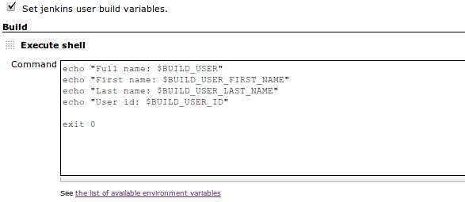

# Build User Vars Plugin

[](https://ci.jenkins.io/job/Plugins/job/build-user-vars-plugin/job/master/)
[](https://github.com/jenkinsci/build-user-vars-plugin/graphs/contributors)
[](https://plugins.jenkins.io/build-user-vars-plugin)
[](https://github.com/jenkinsci/build-user-vars-plugin/releases/latest)
[](https://plugins.jenkins.io/build-user-vars-plugin)

Set of **environment variables** that describe the user who started the build.

## Variables provided

The plugin provides the following environment variables:

| Variable                 | Description                        |
| ------------------------ | ---------------------------------- |
| BUILD\_USER              | Full name (first name + last name) |
| BUILD\_USER\_FIRST\_NAME | First name                         |
| BUILD\_USER\_LAST\_NAME  | Last name                          |
| BUILD\_USER\_ID          | Jenkins user ID                    |
| BUILD\_USER\_GROUPS      | Jenkins user groups                |
| BUILD\_USER\_EMAIL       | Email address                      |

## Since 1.8

Set the global option to add build user variables to the environment for all builds (in **Manage Jenkins, Configure System**).

## Usage example

Select *Set Jenkins user build variables* and reference the variables during the build:



## Pipeline Examples

```groovy
node {
  wrap([$class: 'BuildUser']) {
    def user = env.BUILD_USER_ID
  }
}
```

## Changelog

Release notes are available in [GitHub Releases](https://github.com/jenkinsci/build-user-vars-plugin/releases) since July 2020 (build-user-vars plugin 1.6 and later).
Prior release notes are available in the plugin repository [changelog](https://github.com/jenkinsci/build-user-vars-plugin/blob/master/CHANGELOG.md).

## Jenkins core compatibility

This plugin requires Jenkins 2.164.1+.
